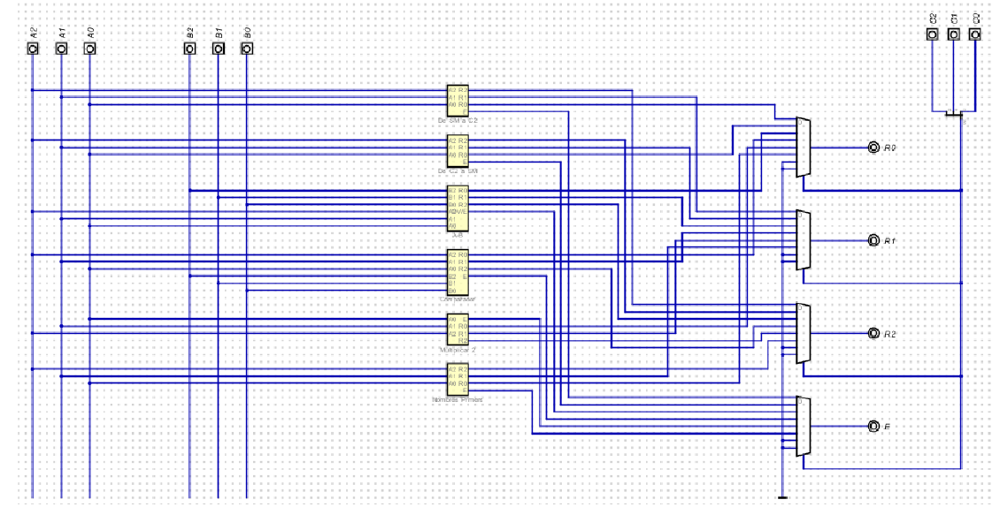
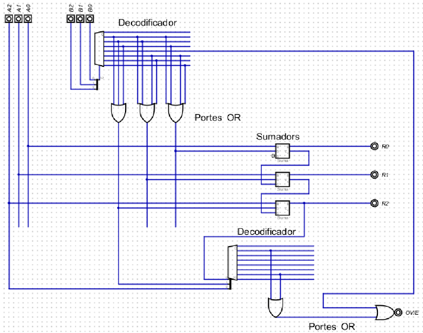
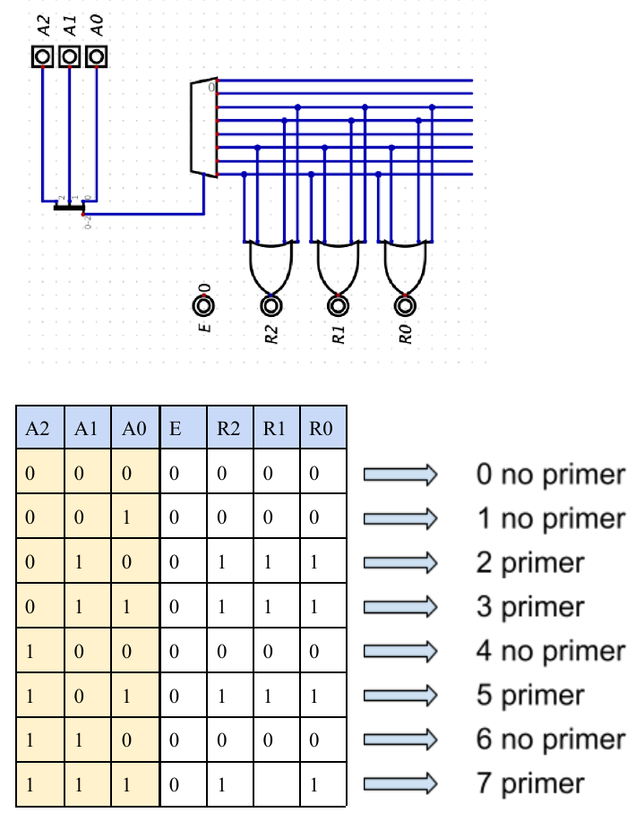
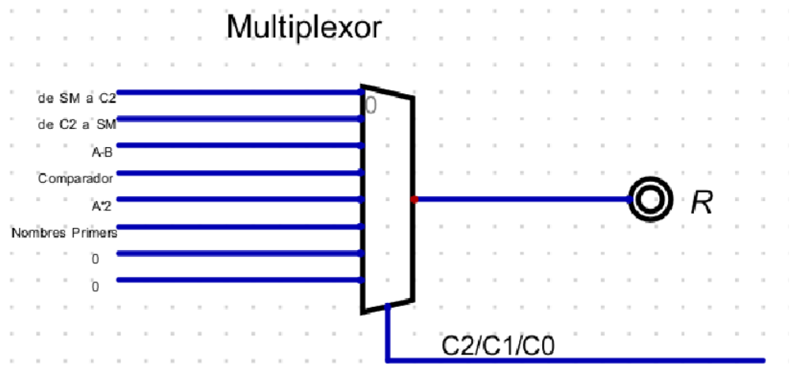

# ALU combinacional de 3 bits en Digital

Proyecto académico de **Sistemas Digitales** centrado en el diseño e implementación de una **Unidad Aritmético-Lógica (ALU)** usando la herramienta **Digital**. El circuito trabaja con dos operandos de 3 bits y permite ejecutar distintas operaciones combinacionales en función de un código de control.



## Descripción del proyecto

La práctica consiste en diseñar una **ALU de 3 bits** con:

- **Entradas de datos:** `A2 A1 A0` y `B2 B1 B0`
- **Entradas de control:** `C2 C1 C0`
- **Salidas de resultado:** `R2 R1 R0`
- **Bit extra:** `E`, utilizado para casos especiales según la operación

El objetivo del trabajo fue resolver cada operación por separado, comprobarla con su juego de pruebas y, finalmente, integrarla dentro de una **ALU global** mediante multiplexores.

## Operaciones implementadas

| Código `C2 C1 C0` | Operación | Descripción |
|---|---|---|
| `000` | SM → C2 | Conversión de signo y magnitud a complemento a 2 |
| `001` | C2 → SM | Conversión de complemento a 2 a signo y magnitud |
| `010` | `A - B` | Resta en complemento a 2 con detección de overflow |
| `011` | Comparador | Devuelve si `A > B`, `A = B` o `A < B` |
| `100` | `A × 2` | Multiplicación por 2 en binario natural sin signo |
| `101` | Número primo | Detecta si `A` representa un número primo |

### Comportamiento del bit `E`

Dependiendo de la operación, el bit `E` se usa de forma distinta:

- En las conversiones (`000` y `001`), indica si el valor **no es representable** en el formato de salida.
- En la resta (`010`), indica **overflow**.
- En la multiplicación por 2 (`100`), actúa como **cuarto bit de salida**.
- En el comparador (`011`) y en la detección de primos (`101`), **no se utiliza**.

## Estructura del repositorio

El proyecto está dividido en un circuito global y varios circuitos individuales:

```text
.
├── solucio.dig
├── De SM a C2.dig
├── De C2 a SM.dig
├── A-B.dig
├── Comparador.dig
├── Multiplicar 2.dig
└── Nombres Primers.dig
```

### Archivo principal

- **`solucio.dig`**: contiene la ALU completa, uniendo todas las operaciones individuales.

### Subcircuitos

- **`De SM a C2.dig`**: conversor de signo y magnitud a complemento a 2.
- **`De C2 a SM.dig`**: conversor de complemento a 2 a signo y magnitud.
- **`A-B.dig`**: restador de 3 bits con detección de overflow.
- **`Comparador.dig`**: comparador con operación en signo.
- **`Multiplicar 2.dig`**: multiplicador por 2 para valores sin signo.
- **`Nombres Primers.dig`**: detector de números primos.

## Capturas del diseño

### Diseño global

El circuito final integra los 6 bloques funcionales en una única ALU y selecciona la salida correcta mediante multiplexores.


### Restador `A - B`

Implementación de la resta en complemento a 2, incluyendo lógica adicional para detectar overflow.



### Detección de números primos

Subcircuito que activa la salida `111` cuando el valor de `A` corresponde a un número primo.



### Multiplexor de selección

La ALU global utiliza multiplexores para elegir la salida correspondiente a cada operación según el código de control `C2 C1 C0`.



## Conceptos trabajados

Durante esta práctica se aplican conceptos fundamentales de diseño digital:

- Circuitos combinacionales
- Conversión entre representaciones binarias
- Detección de overflow
- Comparación con signo
- Uso de decodificadores
- Splitters / aggregators
- Puertas OR
- Sumadores
- Multiplexores
- Diseño modular por subcircuitos
- Verificación mediante juegos de pruebas

## Cómo abrir el proyecto

1. Abrir la herramienta **Digital**.
2. Cargar el archivo **`solucio.dig`** para ver la ALU completa.
3. Abrir los archivos individuales si se quiere revisar cada operación por separado.
4. Probar distintas combinaciones de entrada en `A`, `B` y `C` para verificar el comportamiento de las salidas `R` y `E`.

## Qué demuestra este proyecto

Este trabajo refleja un enfoque progresivo de diseño digital:

- resolución individual de cada operación,
- validación mediante pruebas,
- integración en un circuito global,
- y selección funcional a través de señales de control.

Es una práctica muy representativa para mostrar bases de **arquitectura lógica**, **álgebra booleana aplicada**, **modularidad** y **análisis de representación binaria**.

## Nota

Este repositorio recoge una **práctica académica** realizada en la asignatura de **Sistemas Digitales**. Su objetivo principal es documentar el proceso de diseño de una ALU sencilla y servir como referencia de aprendizaje.
